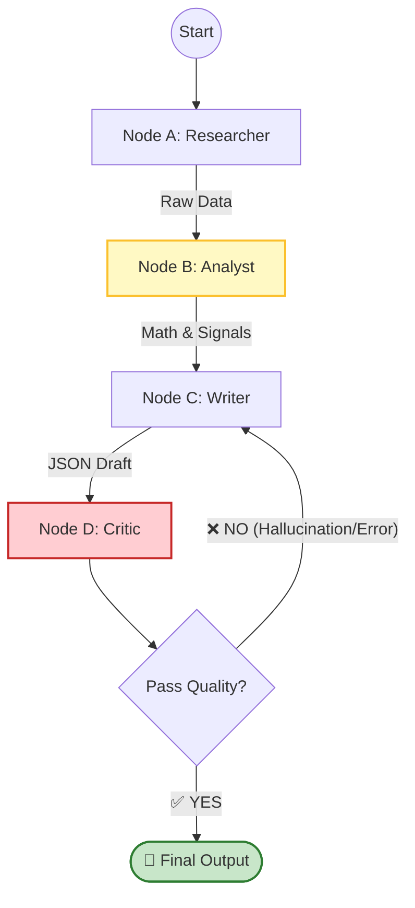

# Autonomous Agentic AI Stock Dashboard

This project delivers a TradingView-style dashboard backed by a LangGraph multi-agent workflow (Researcher → Analyst → Writer → Critic) with FastAPI and a Next.js 14 frontend. Philosophy: deterministic math in Python; LLM only for reasoning and Thai-language reporting.

## Stack
- Frontend: Next.js 14 (App Router), TypeScript, Tailwind CSS, lightweight-charts
- Backend: FastAPI, LangGraph for state workflow, pandas/pandas-ta/yfinance for deterministic TA
- DB (planned): PostgreSQL + TimescaleDB for time-series (hooks ready to attach)
- LLM: GPT-4o (default, configurable), Claude 3.5 Sonnet compatible

## Key Files
- `backend/agents/graph.py` — LangGraph pipeline (Researcher, Analyst, Writer, Critic, retry guard)
- `backend/agents/tools.py` — robust OHLCV + news fetchers (hard fail for prices, soft fail for news)
- `backend/calculations.py` — pure Python technical indicators (RSI, MACD, SMA50/200, EMA20, Bollinger)
- `backend/main.py` — FastAPI endpoints: history, news, analyze trigger/poll
- `frontend/components/Chart.tsx` — lightweight-charts candlestick with overlays and sub-panels
- `frontend/app/page.tsx` — dashboard shell (ticker search, timeframe, analyze trigger, news, AI insight)

## Running (dev)
1) Backend (Python 3.11+):
```bash
pip install -r backend/requirements.txt
uvicorn backend.main:app --reload --port 8000
```
Set `OPENAI_API_KEY` (and `TAVILY_API_KEY` for news) in your environment.

2) Frontend (Node 18+):
```bash
cd frontend
npm install
npm run dev
```
Configure the frontend to call `http://localhost:8000` or proxy via `NEXT_PUBLIC_API_BASE`.

## API
- `GET /api/market/history?ticker=AAPL&period=1y&interval=1d` → OHLCV for charts
- `GET /api/market/news?ticker=AAPL` → soft-fail news list
- `POST /api/analyze?ticker=AAPL` → starts agent task, returns `task_id`
- `GET /api/analyze/{task_id}` → task status + final JSON report

## System Flow (Mermaid)


## Notes
- Researcher retries prices (3x) then fails; news failures return `[]` so the pipeline never crashes.
- Critic enforces JSON + numeric parity with computed indicators; after 2 failed revisions it publishes with `Low` confidence to avoid infinite loops.
- Frontend renders the AI report in Thai with exact technical values; export-to-PDF/Markdown can be added by wiring the JSON to your preferred exporter.
